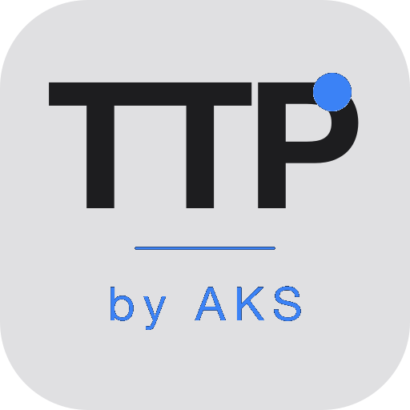

<p align="center">
  
</p>

<h1 align="center">TTP — Talk To Paste</h1>

<p align="center">
  <strong>Press a shortcut. Speak. Your words appear wherever you're typing.</strong>
</p>

<p align="center">
  <a href="https://github.com/AmirK-S/TTP/actions/workflows/build.yml"></a>
  <a href="https://github.com/AmirK-S/TTP/releases"></a>
  <a href="https://github.com/AmirK-S/TTP/releases"></a>
</p>

<p align="center">
  <a href="https://ttp.amirks.eu">Website</a> &middot;
  <a href="https://github.com/AmirK-S/TTP/releases">Download</a> &middot;
  <a href="https://github.com/AmirK-S/TTP/releases">Changelog</a> &middot;
  <a href="https://amirks.lemonsqueezy.com/buy/dcc74241-21ae-4d20-8a3c-90bf8d842bae">Buy Pro</a>
</p>

---

TTP is a lightweight desktop app that turns speech into text — instantly, in any app. Hold a shortcut, speak, and your words are transcribed and pasted wherever your cursor is. No switching apps, no copy-pasting, just talk.

Free forever. No account required. Bring your own Groq API key.

## Features

- **Lightning fast** — Powered by Groq Whisper. Transcription in under 2 seconds.
- **Works everywhere** — Paste into Slack, VS Code, Gmail, Notion, any app where you type.
- **AI polish** — Automatically removes filler words, fixes grammar, cleans up your text.
- **Smart dictionary** — Learns your names, jargon, and technical terms.
- **Mac + Windows** — Native app, lives in your menu bar / system tray.
- **Privacy first** — API keys and history stored locally. Nothing leaves your machine.
- **Auto updates** — Updates install automatically in the background.

## Trust & Security

TTP runs on your machine and handles your voice and your API keys, so we treat the security pipeline as a feature.

- **Signed + notarized macOS builds** — every release is code-signed with an Apple Developer ID certificate and notarized through Apple's notary service before shipping.
- **Code-signed Windows installers** — `.msi` and NSIS `-setup.exe` artifacts are signed in CI when the Windows certificate is configured.
- **Minisign-verified auto-updates** — the Tauri updater verifies every update payload against a minisign public key embedded in the app at install time; tampered updates are rejected.
- **OS keychain for API keys** — your Groq API key lives in the macOS Keychain (and Windows Credential Manager on Windows), not in plaintext config files.
- **HMAC-signed local caches** — the offline license cache and Pro usage counters are HMAC-signed with a per-machine secret stored in your OS keychain, so a license file forged on one machine won't be accepted on another.
- **Telemetry off by default** — Sentry crash reporting and Aptabase usage analytics are opt-in only and disabled until you explicitly enable them in Settings.
- **Strict CSP, no remote webview content** — the embedded webview only loads bundled assets; there's no external network reachable from the UI layer.
- **Third-party calls are listed in the [privacy policy](https://ttp.amirks.eu/privacy)** — Groq, Lemon Squeezy, GitHub (updater feed), Sentry, and Aptabase. No other network calls are made.

Found a security issue? Please report it privately — see [SECURITY.md](SECURITY.md).

## How It Works

1. **Hold your shortcut** — On Mac, just press `Fn`. On Windows, configure your preferred key.
2. **Speak** — Talk naturally. TTP records your voice in the background.
3. **Text appears** — Your words are transcribed and pasted instantly into the active app.

## Installation

### Download

Grab the latest release for your platform:

- **macOS** — `.dmg` from [Releases](https://github.com/AmirK-S/TTP/releases)
- **Windows** — `.msi` from [Releases](https://github.com/AmirK-S/TTP/releases)

### Setup

1. Install the app
2. Get a free API key from [Groq Console](https://console.groq.com)
3. Paste the key in TTP's setup screen
4. Start talking

## Build from Source

### Prerequisites

- [Node.js](https://nodejs.org/) 18+
- [Rust](https://www.rust-lang.org/tools/install) (latest stable)
- [Tauri CLI](https://v2.tauri.app/start/prerequisites/)

### Steps

```bash
# Clone the repo
git clone https://github.com/AmirK-S/TTP.git
cd TTP

# Install dependencies
npm install

# Run in development
npm run tauri dev

# Build for production
npm run tauri build
```

## Tech Stack

| Layer | Technology |
|-------|-----------|
| Framework | [Tauri 2](https://v2.tauri.app/) |
| Frontend | React + TypeScript |
| Backend | Rust |
| Styling | Tailwind CSS |
| Transcription | [Groq Whisper](https://groq.com/) (whisper-large-v3) |
| AI Polish | Groq LLM (llama-3.3-70b-versatile) |
| Landing Page | [Astro](https://astro.build/) + GSAP |

## Project Structure

```
TTP/
├── src/                  # React frontend
│   ├── components/       # UI components (Pill, Setup, History)
│   └── hooks/            # Recording control, settings, dictionary
├── src-tauri/            # Rust backend
│   └── src/
│       ├── transcription/  # Whisper API + LLM polish pipeline
│       ├── dictionary/     # Smart dictionary with auto-detection
│       ├── paste/          # Clipboard + accessibility paste
│       └── fnkey.rs        # macOS Fn key listener
└── landing/              # Astro landing page (amirks.eu)
```

## Author

**Amir Kellou-Sidhoum** — AI Engineer / Builder / Consultant

- [LinkedIn](https://www.linkedin.com/in/amirks/)
- [Website](https://amirks.eu)

---

<p align="center">
  Made with care.
</p>
