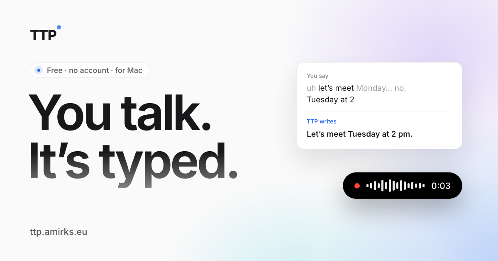

<p align="center">
  
</p>

<h1 align="center">TTP — Talk To Paste</h1>

<p align="center">
  <strong>Press a shortcut. Speak. Your words appear wherever you're typing.</strong>
</p>

<p align="center">
  <a href="https://github.com/AmirK-S/TTP/actions/workflows/build.yml"></a>
  <a href="https://github.com/AmirK-S/TTP/releases"></a>
  <a href="https://github.com/AmirK-S/TTP/releases"></a>
</p>

<p align="center">
  <a href="https://ttp.amirks.eu">Website</a> &middot;
  <a href="https://github.com/AmirK-S/TTP/releases">Download</a> &middot;
  <a href="https://github.com/AmirK-S/TTP/releases">Changelog</a>
</p>

<p align="center">
  
</p>

---

TTP is a lightweight desktop app that turns speech into text in any app. Hold a shortcut, speak, and your words are transcribed and pasted wherever your cursor is. No switching apps, no copy-pasting, just talk.

Built for long dictations: minutes of speech, with pauses to think, come back whole.

Free. No account required. Bring your own Groq API key.

## Features

- **Accurate on long dictations** — Whisper large-v3 on Groq. Pauses and quiet speech are kept, not dropped as silence.
- **Works everywhere** — Paste into Slack, VS Code, Gmail, Notion, any app where you type.
- **AI polish** — Removes filler words and fixes grammar with a Groq LLM pass.
- **Smart dictionary** — Learns your names, jargon, and technical terms post-paste.
- **Any shortcut** — Fn, a key, a modifier or a mouse button, plus an optional second one. Hold to talk, or double-tap for hands-free.
- **Auto-stop after silence** (opt-in) — End the recording automatically when you've stopped speaking.
- **Mac + Windows** — Native app, lives in your menu bar / system tray. Speaks English and French.
- **Clear about your data** — Your voice goes to Groq for transcription, with your own key. There is no TTP server. Keys live in your OS keychain, history stays local, crash reports are opt-in.
- **Updates without interruption** — Minisign-verified updates download in the background and install during a two-minute pause.

## Trust & Security

TTP runs on your machine and handles your voice and your API keys, so we treat the security pipeline as a feature.

- **Signed + notarized macOS builds** — every release is code-signed with an Apple Developer ID certificate and notarized through Apple's notary service before shipping.
- **Code-signed Windows installers** — `.msi` and NSIS `-setup.exe` artifacts are signed in CI when the Windows certificate is configured.
- **Minisign-verified auto-updates** — the Tauri updater verifies every update payload against a minisign public key embedded in the app at install time; tampered updates are rejected.
- **OS keychain for API keys** — your Groq API key lives in the macOS Keychain (and Windows Credential Manager on Windows), not in plaintext config files.
- **HMAC-signed local caches** — the offline licence cache (for the optional supporter licence) is HMAC-signed with a per-machine secret stored in your OS keychain, so a licence file forged on one machine won't be accepted on another.
- **Telemetry off by default** — Sentry crash reporting is opt-in and disabled until you explicitly enable it in Settings. No usage analytics are collected.
- **Strict CSP, no remote webview content** — the embedded webview only loads bundled assets; the only outbound endpoints reachable from the renderer are Groq and Sentry.
- **Third-party calls are listed in the [privacy policy](https://ttp.amirks.eu/privacy)** — Groq, Lemon Squeezy, GitHub (updater feed), Sentry. No other network calls are made.

Found a security issue? Please report it privately — see [SECURITY.md](SECURITY.md). The threat model that scopes "in scope" vs "out of scope" reports lives in [THREAT_MODEL.md](THREAT_MODEL.md).

## How It Works

1. **Hold your shortcut** — `Fn` by default on Mac; any key, modifier or mouse button you choose.
2. **Speak** — Talk naturally. TTP records your voice in the background.
3. **Text appears** — Your words are transcribed and pasted into the active app, typically about a second and a half after you let go.

## Installation

### Download

Grab the latest release for your platform:

- **macOS** — `.dmg` from [Releases](https://github.com/AmirK-S/TTP/releases)
- **Windows** — `-setup.exe` or `.msi` from [Releases](https://github.com/AmirK-S/TTP/releases)

### Setup

1. Install the app
2. Get a free API key from [Groq Console](https://console.groq.com)
3. Paste the key in TTP's setup screen
4. Start talking

## Build from Source

### Prerequisites

- [Node.js](https://nodejs.org/) 18+
- [Rust](https://www.rust-lang.org/tools/install) (latest stable)
- [Tauri CLI](https://v2.tauri.app/start/prerequisites/)

### Steps

```bash
# Clone the repo
git clone https://github.com/AmirK-S/TTP.git
cd TTP

# Install dependencies
npm install

# Run in development
npm run tauri dev

# Build for production
npm run tauri build
```

## Tech Stack

| Layer | Technology |
|-------|-----------|
| Framework | [Tauri 2](https://v2.tauri.app/) |
| Frontend | React + TypeScript |
| Backend | Rust |
| Styling | Tailwind CSS |
| Transcription | [Groq Whisper](https://groq.com/) (whisper-large-v3) |
| AI Polish | Groq LLM (openai/gpt-oss-120b) |
| Landing Page | [Astro](https://astro.build/) |

## Project Structure

```
TTP/
├── src/                  # React frontend
│   ├── components/       # UI components + design primitives (Button, Modal, ...)
│   ├── hooks/            # Recording / transcription / updater / Tauri events
│   ├── lib/              # Pure helpers (theme, i18n, PII scrub, ...)
│   ├── stores/           # Zustand settings store
│   ├── windows/          # Settings · Onboarding · FloatingBar · PermissionHelper
│   └── i18n/             # EN + FR translation tables
├── src-tauri/            # Rust backend
│   └── src/
│       ├── transcription/  # Whisper + LLM polish + cleanup + dictionary apply
│       ├── dictionary/     # Smart dictionary with auto-detection
│       ├── audio_capture.rs / audio_monitor.rs / vad.rs   # cpal + RMS + VAD
│       ├── fnkey.rs / fnkey_fsm.rs  # macOS Fn key (FSM is pure + unit-tested)
│       ├── state.rs / shortcuts.rs / tray.rs              # Recording lifecycle
│       ├── settings/ + usage/ + history/ + licensing/     # Persistence layers
│       └── telemetry/ + logging.rs                        # Observability
├── docs/architecture.md  # Runtime architecture + diagrams
├── THREAT_MODEL.md       # In-scope vs out-of-scope security boundaries
└── landing/              # Astro landing page (ttp.amirks.eu)
```

### Running tests

* **Frontend** — `npm run test:run` (vitest + happy-dom, ~150 tests).
* **Rust** — `cd src-tauri && cargo test --lib` (~470 tests across the Fn FSM,
  HMAC, settings, pipeline classifiers, silence gate, dictionary, VAD).
* **Build-time gates** — `npm run i18n:check` validates locale parity AND that
  every `t('xxx')` callsite resolves against a real key. Wired into
  `npm run build`.

## Author

**Amir Kellou-Sidhoum** — AI Engineer / Builder / Consultant

- [LinkedIn](https://www.linkedin.com/in/amirks/)
- [Website](https://amirks.eu)

---

<p align="center">
  Made with care.
</p>
